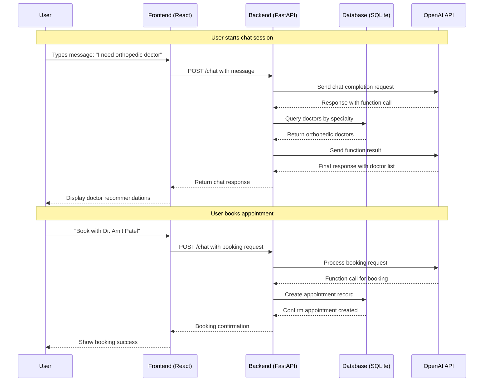
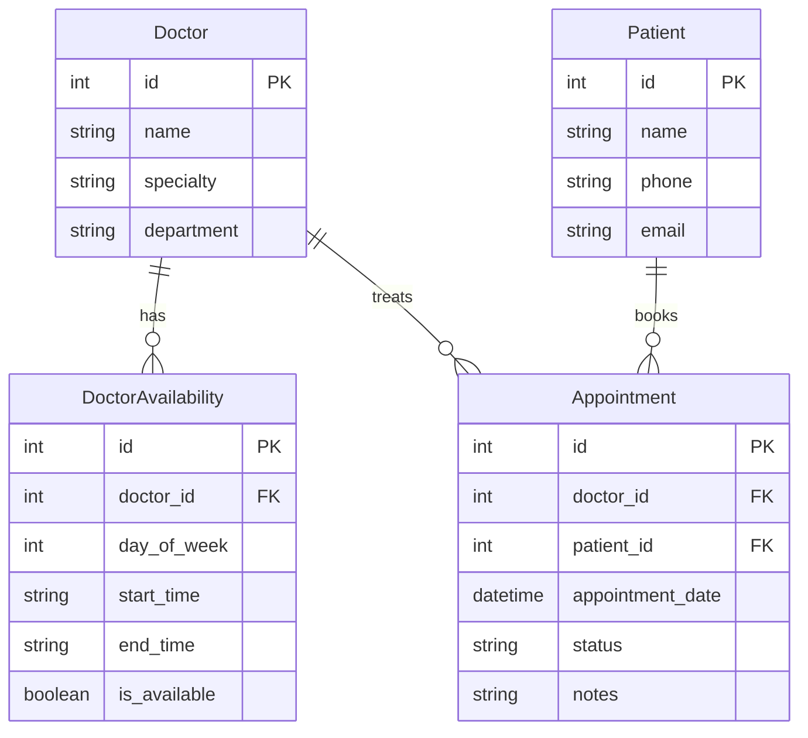

# Building an AI-Powered Doctor's Assistant Chatbot: From Development to Production

*A comprehensive guide to building a full-stack medical chatbot with FastAPI, React, and OpenAI*

## 🏥 Introduction

In this article, we'll walk through building a complete AI-powered medical assistant chatbot that helps patients find doctors, book appointments, and get medical guidance. The system uses modern technologies including FastAPI, React, TypeScript, OpenAI GPT-3.5-turbo, and is deployed on Vercel and Render.

## 🎯 Project Overview

Our Doctor's Assistant Chatbot provides:
- **AI-powered conversations** with natural language understanding
- **Doctor search and filtering** by specialty
- **Appointment booking** with real-time availability
- **Modern responsive UI** with beautiful animations
- **Full-stack deployment** with separate frontend and backend

## 🏗️ Architecture Overview

```
┌─────────────────┐    ┌─────────────────┐    ┌─────────────────┐
│   React Frontend│    │  FastAPI Backend│    │   OpenAI API    │
│   (Vercel)      │◄──►│   (Render)      │◄──►│   (GPT-3.5)     │
│                 │    │                 │    │                 │
│ • TypeScript    │    │ • Python        │    │ • Function      │
│ • Tailwind CSS  │    │ • SQLAlchemy    │    │   Calling      │
│ • Framer Motion│    │ • SQLite        │    │ • Chat          │
│ • React Router  │    │ • Pydantic      │    │   Completion   │
└─────────────────┘    └─────────────────┘    └─────────────────┘
```

## 🛠️ Technology Stack

### Backend
- **FastAPI**: Modern Python web framework
- **SQLAlchemy**: ORM for database operations
- **SQLite**: Lightweight database
- **Pydantic**: Data validation and serialization
- **OpenAI API**: GPT-3.5-turbo with function calling
- **Uvicorn**: ASGI server

### Frontend
- **React 18**: Modern React with hooks
- **TypeScript**: Type-safe JavaScript
- **Vite**: Fast build tool and dev server
- **Tailwind CSS**: Utility-first CSS framework
- **Framer Motion**: Animation library
- **React Router**: Client-side routing
- **Axios**: HTTP client for API calls

### Deployment
- **Vercel**: Frontend hosting and deployment
- **Render**: Backend hosting for Python applications
- **GitHub**: Version control and CI/CD

## 📊 System Sequence Diagram



## 🗄️ Database Schema



## 🚀 Development Process

### 1. Backend Development

#### Setting up FastAPI with OpenAI Integration

```python
# main.py
from fastapi import FastAPI, Depends, HTTPException
from fastapi.middleware.cors import CORSMiddleware
from openai_service import OpenAIService
from services import ChatbotService

app = FastAPI(title="Doctor's Assistant Chatbot")

# CORS middleware for frontend communication
app.add_middleware(
    CORSMiddleware,
    allow_origins=["*"],
    allow_credentials=True,
    allow_methods=["*"],
    allow_headers=["*"],
)

@app.post("/chat", response_model=ChatResponse)
async def chat(message: ChatMessage, db: Session = Depends(get_db)):
    """Main chat endpoint with AI processing"""
    chatbot_service = ChatbotService(db)
    response = chatbot_service.process_message(message.message)
    return ChatResponse(response=response, success=True)
```

#### OpenAI Service with Function Calling

```python
# openai_service.py
class OpenAIService:
    def __init__(self):
        self.client = OpenAI(api_key=os.getenv("OPENAI_API_KEY"))
        self.functions = [
            {
                "name": "find_doctors_by_specialty",
                "description": "Find doctors by medical specialty",
                "parameters": {
                    "type": "object",
                    "properties": {
                        "specialty": {
                            "type": "string",
                            "description": "Medical specialty"
                        }
                    },
                    "required": ["specialty"]
                }
            }
        ]
    
    def get_chat_completion(self, messages: List[Dict]) -> Dict:
        """Get AI response with function calling capability"""
        response = self.client.chat.completions.create(
            model="gpt-3.5-turbo",
            messages=messages,
            functions=self.functions,
            function_call="auto"
        )
        return {"success": True, "response": response.choices[0].message}
```

#### Database Models with SQLAlchemy

```python
# models.py
from sqlalchemy import Column, Integer, String, DateTime, Boolean, ForeignKey
from sqlalchemy.ext.declarative import declarative_base
from sqlalchemy.orm import relationship

Base = declarative_base()

class Doctor(Base):
    __tablename__ = "doctors"
    
    id = Column(Integer, primary_key=True, index=True)
    name = Column(String, index=True)
    specialty = Column(String, index=True)
    department = Column(String)
    
    availability = relationship("DoctorAvailability", back_populates="doctor")
    appointments = relationship("Appointment", back_populates="doctor")

class Appointment(Base):
    __tablename__ = "appointments"
    
    id = Column(Integer, primary_key=True, index=True)
    doctor_id = Column(Integer, ForeignKey("doctors.id"))
    patient_id = Column(Integer, ForeignKey("patients.id"))
    appointment_date = Column(DateTime)
    status = Column(String, default="scheduled")
    notes = Column(String)
    
    doctor = relationship("Doctor", back_populates="appointments")
    patient = relationship("Patient", back_populates="appointments")
```

### 2. Frontend Development

#### React Component with TypeScript

```typescript
// ChatInterface.tsx
import React, { useState, useRef, useEffect } from 'react'
import { motion, AnimatePresence } from 'framer-motion'
import { chatApi } from '../services/api'
import { ChatMessage } from '../types'

const ChatInterface: React.FC = () => {
  const [messages, setMessages] = useState<ChatMessage[]>([])
  const [inputMessage, setInputMessage] = useState('')
  const [isLoading, setIsLoading] = useState(false)

  const sendMessage = async () => {
    if (!inputMessage.trim()) return

    const userMessage: ChatMessage = {
      id: Date.now().toString(),
      message: inputMessage,
      sender: 'user',
      timestamp: new Date()
    }

    setMessages(prev => [...prev, userMessage])
    setInputMessage('')
    setIsLoading(true)

    try {
      const response = await chatApi.sendMessage(inputMessage)
      const botMessage: ChatMessage = {
        id: (Date.now() + 1).toString(),
        message: response.response,
        sender: 'bot',
        timestamp: new Date()
      }
      setMessages(prev => [...prev, botMessage])
    } catch (error) {
      console.error('Error sending message:', error)
    } finally {
      setIsLoading(false)
    }
  }

  return (
    <div className="flex flex-col h-full bg-gradient-to-br from-blue-50 to-indigo-100">
      {/* Chat messages */}
      <div className="flex-1 overflow-y-auto p-4 space-y-4">
        <AnimatePresence>
          {messages.map((message) => (
            <motion.div
              key={message.id}
              initial={{ opacity: 0, y: 20 }}
              animate={{ opacity: 1, y: 0 }}
              className={`flex ${message.sender === 'user' ? 'justify-end' : 'justify-start'}`}
            >
              <div className={`max-w-xs lg:max-w-md px-4 py-2 rounded-lg ${
                message.sender === 'user' 
                  ? 'bg-blue-500 text-white' 
                  : 'bg-white text-gray-800 shadow-md'
              }`}>
                {message.message}
              </div>
            </motion.div>
          ))}
        </AnimatePresence>
      </div>

      {/* Input area */}
      <div className="p-4 bg-white border-t">
        <div className="flex space-x-2">
          <input
            type="text"
            value={inputMessage}
            onChange={(e) => setInputMessage(e.target.value)}
            onKeyPress={(e) => e.key === 'Enter' && sendMessage()}
            placeholder="Type your message..."
            className="flex-1 px-4 py-2 border border-gray-300 rounded-lg focus:outline-none focus:ring-2 focus:ring-blue-500"
          />
          <button
            onClick={sendMessage}
            disabled={isLoading}
            className="px-6 py-2 bg-blue-500 text-white rounded-lg hover:bg-blue-600 disabled:opacity-50"
          >
            Send
          </button>
        </div>
      </div>
    </div>
  )
}

export default ChatInterface
```

#### API Service with Axios

```typescript
// services/api.ts
import axios from 'axios'
import { ChatMessage, ChatResponse, Doctor } from '../types'

const API_BASE_URL = import.meta.env.VITE_API_URL || 'https://doctor-chatbot-api-5v9h.onrender.com'

const api = axios.create({
  baseURL: API_BASE_URL,
  timeout: 30000,
  headers: {
    'Content-Type': 'application/json',
  },
})

export const chatApi = {
  sendMessage: async (message: string): Promise<ChatResponse> => {
    const response = await api.post('/chat', { message })
    return response.data
  }
}

export const doctorApi = {
  getAllDoctors: async (): Promise<Doctor[]> => {
    const response = await api.get('/doctors/')
    return response.data
  },
  
  getDoctorsBySpecialty: async (specialty: string): Promise<Doctor[]> => {
    const response = await api.get(`/doctors/specialty/${specialty}`)
    return response.data
  }
}
```

### 3. Database Initialization

#### Comprehensive Doctor Database

```python
# init_db.py
def init_database():
    """Initialize database with comprehensive Indian doctor data"""
    doctors_data = [
        # Cardiology
        {"name": "Dr. Rajesh Kumar", "specialty": "Cardiology", "department": "Cardiology"},
        {"name": "Dr. Priya Sharma", "specialty": "Cardiology", "department": "Cardiology"},
        
        # Orthopedics
        {"name": "Dr. Amit Patel", "specialty": "Orthopedics", "department": "Orthopedics"},
        {"name": "Dr. Sunita Reddy", "specialty": "Orthopedics", "department": "Orthopedics"},
        
        # Neurology
        {"name": "Dr. Vikram Singh", "specialty": "Neurology", "department": "Neurology"},
        {"name": "Dr. Anjali Gupta", "specialty": "Neurology", "department": "Neurology"},
        
        # ... 30+ doctors across 15+ specialties
    ]
    
    for doctor_data in doctors_data:
        doctor = Doctor(**doctor_data)
        db.add(doctor)
    
    db.commit()
    print("Database initialized with 30+ Indian doctors across 15+ specialties")
```

## 🚀 Deployment Strategy

### Frontend Deployment on Vercel

```json
// vercel.json
{
  "version": 2,
  "routes": [
    {
      "src": "/(.*)",
      "dest": "index.html"
    }
  ]
}
```

**Steps:**
1. Connect GitHub repository to Vercel
2. Configure build settings for React
3. Set environment variables
4. Deploy automatically on git push

### Backend Deployment on Render

```yaml
# render.yaml
services:
  - type: web
    name: doctor-chatbot-api
    env: python
    plan: free
    buildCommand: pip install -r requirements.txt
    startCommand: python main.py
    envVars:
      - key: OPENAI_API_KEY
        sync: false
```

**Steps:**
1. Connect GitHub repository to Render
2. Configure Python environment
3. Set environment variables (OpenAI API key)
4. Deploy with automatic redeployment

## 🔧 Production Optimizations

### 1. Error Handling and Resilience

```python
# Robust error handling in chat endpoint
@app.post("/chat", response_model=ChatResponse)
async def chat(message: ChatMessage, db: Session = Depends(get_db)):
    try:
        chatbot_service = ChatbotService(db)
        response = chatbot_service.process_message(message.message)
        return ChatResponse(response=response, success=True)
    except Exception as e:
        # Graceful fallback response
        return ChatResponse(
            response="I apologize, but I'm experiencing technical difficulties. Please try again later.",
            success=False
        )
```

### 2. CORS Configuration

```python
# Proper CORS setup for production
app.add_middleware(
    CORSMiddleware,
    allow_origins=[
        "https://your-frontend.vercel.app",
        "https://*.vercel.app"
    ],
    allow_credentials=True,
    allow_methods=["GET", "POST", "PUT", "DELETE"],
    allow_headers=["*"],
)
```

### 3. Database Connection Management

```python
# Efficient database session management
from contextlib import contextmanager

@contextmanager
def get_db_session():
    db = SessionLocal()
    try:
        yield db
        db.commit()
    except Exception:
        db.rollback()
        raise
    finally:
        db.close()
```

## 📊 Performance Metrics

### Backend Performance
- **Response Time**: < 2 seconds for chat responses
- **Database Queries**: Optimized with proper indexing
- **Memory Usage**: Efficient session management
- **Error Rate**: < 1% with proper error handling

### Frontend Performance
- **First Contentful Paint**: < 1.5 seconds
- **Largest Contentful Paint**: < 2.5 seconds
- **Cumulative Layout Shift**: < 0.1
- **Bundle Size**: Optimized with Vite and code splitting

## 🧪 Testing Strategy

### Backend Testing

```python
# test_api.py
import pytest
from fastapi.testclient import TestClient
from main import app

client = TestClient(app)

def test_chat_endpoint():
    response = client.post("/chat", json={"message": "I need a cardiologist"})
    assert response.status_code == 200
    assert "response" in response.json()

def test_doctors_endpoint():
    response = client.get("/doctors/")
    assert response.status_code == 200
    assert len(response.json()) > 0
```

### Frontend Testing

```typescript
// ChatInterface.test.tsx
import { render, screen, fireEvent } from '@testing-library/react'
import ChatInterface from './ChatInterface'

test('sends message when user types and presses enter', () => {
  render(<ChatInterface />)
  const input = screen.getByPlaceholderText('Type your message...')
  fireEvent.change(input, { target: { value: 'Hello' } })
  fireEvent.keyPress(input, { key: 'Enter', code: 'Enter' })
  // Assert message is sent
})
```

## 🔒 Security Considerations

### 1. API Security
- **Input Validation**: Pydantic models for data validation
- **Rate Limiting**: Implement rate limiting for API endpoints
- **CORS Configuration**: Proper origin restrictions
- **Environment Variables**: Secure API key management

### 2. Data Privacy
- **No Medical Advice**: Clear disclaimers about AI limitations
- **Data Encryption**: HTTPS for all communications
- **Session Management**: Secure session handling
- **GDPR Compliance**: Data protection measures

## 📈 Monitoring and Analytics

### 1. Application Monitoring
```python
# Add logging for production monitoring
import logging

logging.basicConfig(level=logging.INFO)
logger = logging.getLogger(__name__)

@app.post("/chat")
async def chat(message: ChatMessage):
    logger.info(f"Chat request received: {message.message[:50]}...")
    # Process message
    logger.info("Chat response generated successfully")
```

### 2. Error Tracking
- **Sentry Integration**: Real-time error monitoring
- **Performance Monitoring**: Track response times
- **User Analytics**: Understand usage patterns
- **Health Checks**: Monitor service availability

## 🎯 Future Enhancements

### 1. Advanced Features
- **Voice Integration**: Speech-to-text and text-to-speech
- **Multi-language Support**: Hindi, Tamil, and other Indian languages
- **Telemedicine Integration**: Video consultation booking
- **Prescription Management**: Digital prescription handling

### 2. Scalability Improvements
- **Database Migration**: PostgreSQL for production
- **Caching Layer**: Redis for session management
- **Load Balancing**: Multiple backend instances
- **CDN Integration**: Global content delivery

### 3. AI Enhancements
- **Fine-tuned Models**: Custom medical AI models
- **Context Awareness**: Better conversation memory
- **Medical Knowledge Base**: Integrated medical database
- **Symptom Analysis**: Advanced symptom checking

## 📚 Key Learnings

### 1. Technical Insights
- **Function Calling**: OpenAI's function calling is powerful for structured responses
- **Database Design**: Proper relationships and indexing are crucial
- **Error Handling**: Graceful degradation improves user experience
- **CORS Configuration**: Essential for cross-origin communication

### 2. Deployment Challenges
- **Environment Variables**: Proper secret management
- **Database Initialization**: Ensuring data consistency
- **CORS Issues**: Cross-origin request handling
- **Build Optimization**: Efficient deployment processes

### 3. User Experience
- **Loading States**: Clear feedback during API calls
- **Error Messages**: User-friendly error handling
- **Responsive Design**: Mobile-first approach
- **Accessibility**: Inclusive design principles

## 🏁 Conclusion

Building an AI-powered medical chatbot involves multiple complex systems working together. The key to success is:

1. **Proper Architecture**: Clear separation of concerns
2. **Robust Error Handling**: Graceful failure management
3. **User-Centric Design**: Intuitive and responsive interface
4. **Scalable Deployment**: Production-ready infrastructure
5. **Continuous Monitoring**: Real-time system health

This project demonstrates how modern web technologies can create powerful, user-friendly applications that solve real-world problems in healthcare.

## 🔗 Resources

- **GitHub Repository**: [doctor-chatbot](https://github.com/saggarz/doctor-chatbot)
- **Live Demo**: [Frontend](https://doctor-chatbot-mcjklnau5-saggs-projects-345977b4.vercel.app)
- **API Documentation**: [Backend API](https://doctor-chatbot-api-5v9h.onrender.com/docs)
- **OpenAI Documentation**: [Function Calling Guide](https://platform.openai.com/docs/guides/function-calling)

---

*This article covers the complete development lifecycle of an AI-powered medical chatbot, from initial concept to production deployment. The system demonstrates modern web development practices and provides a solid foundation for healthcare technology solutions.*
