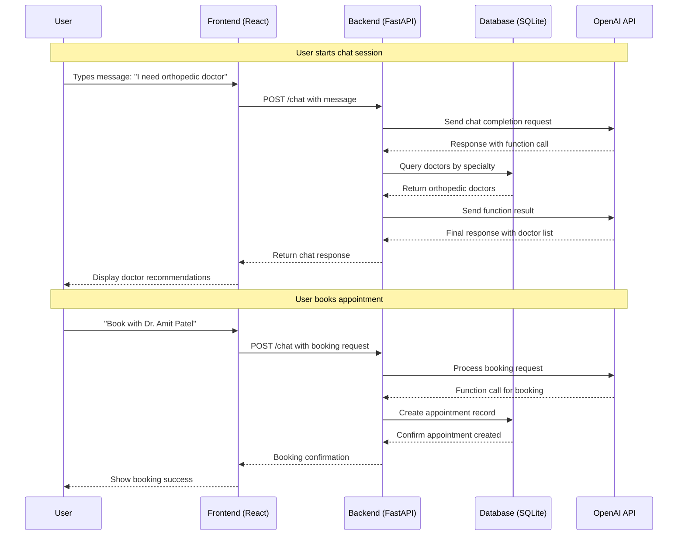
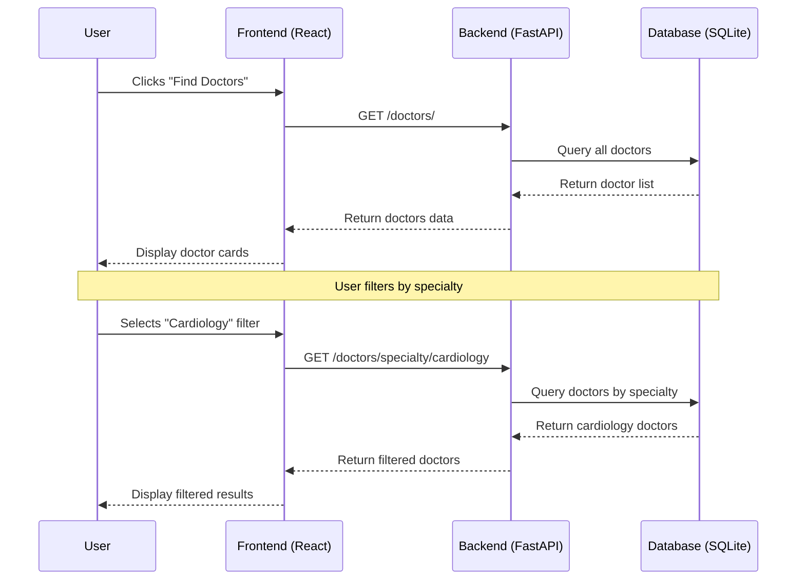
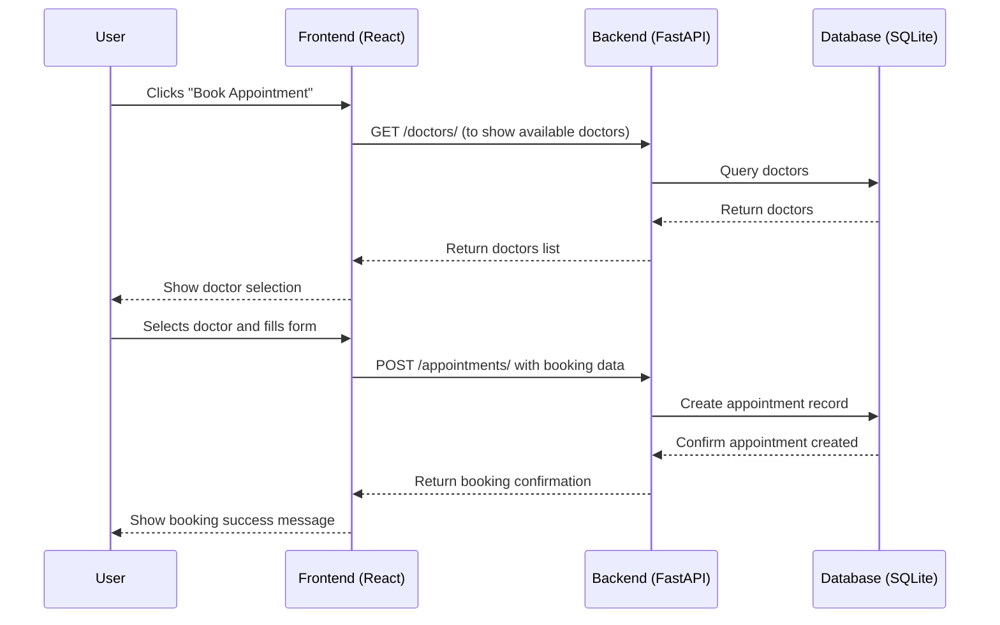
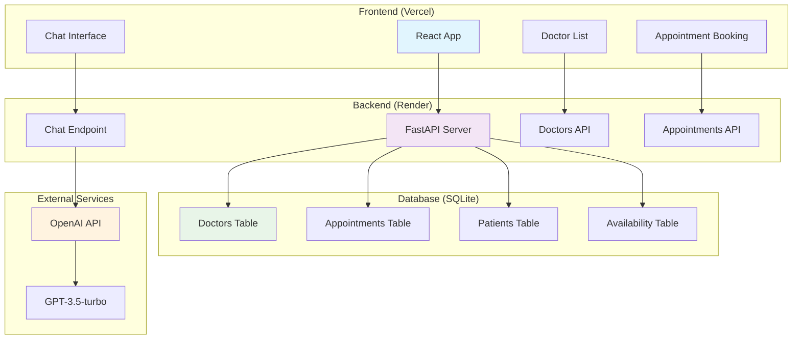
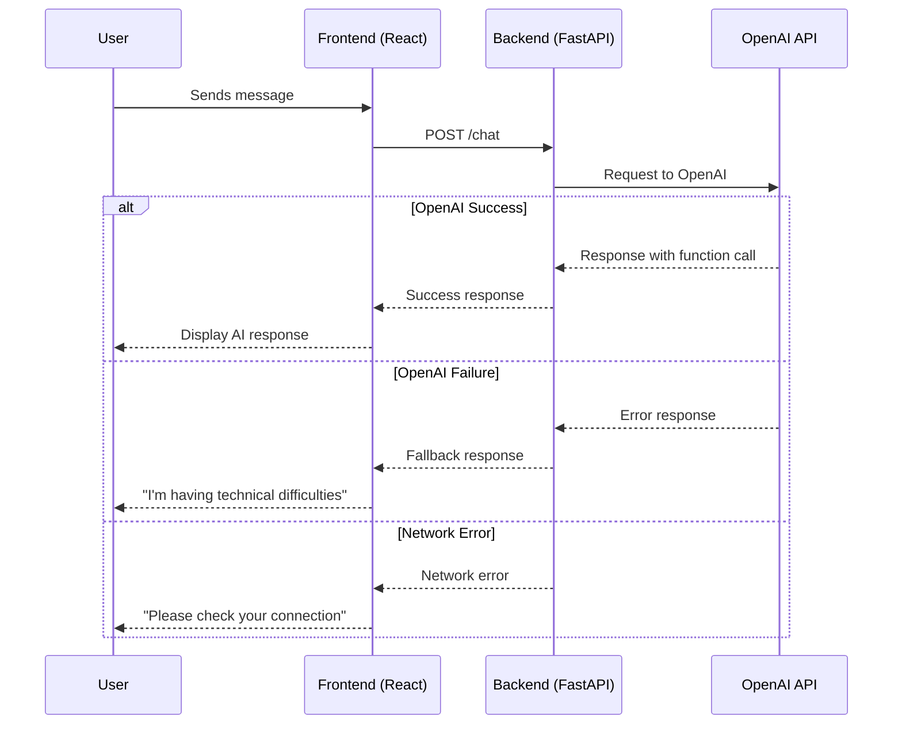
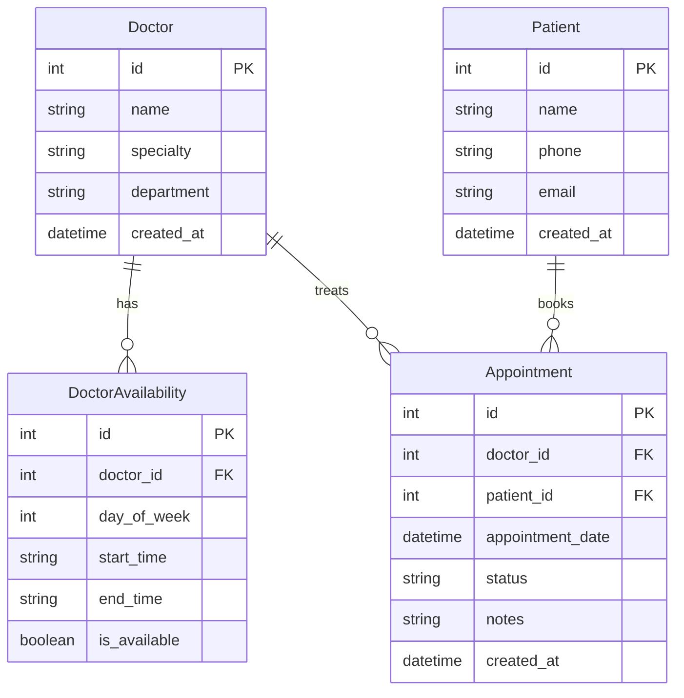
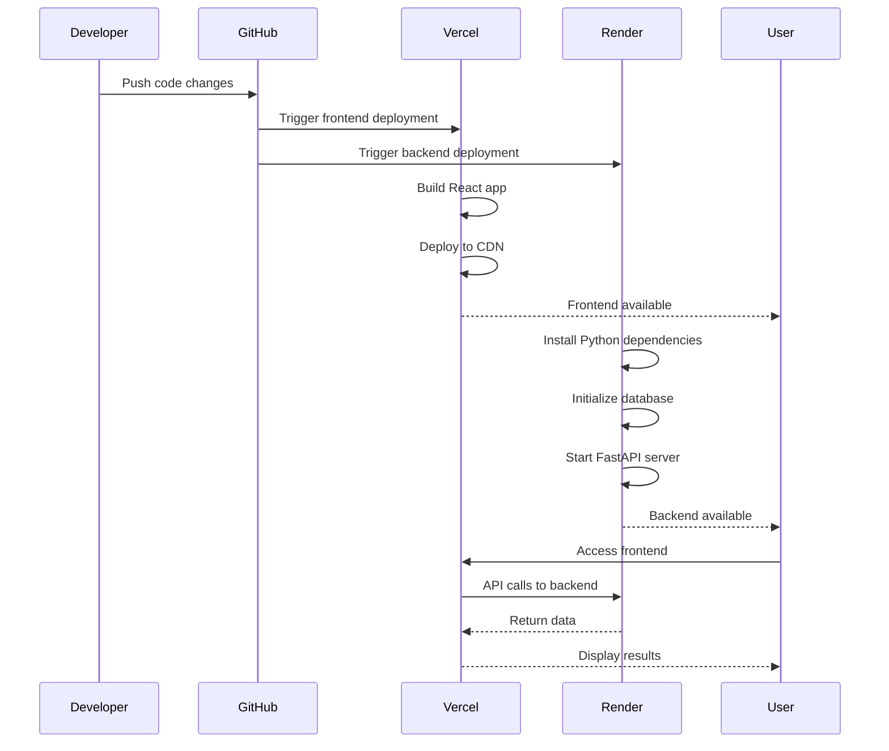
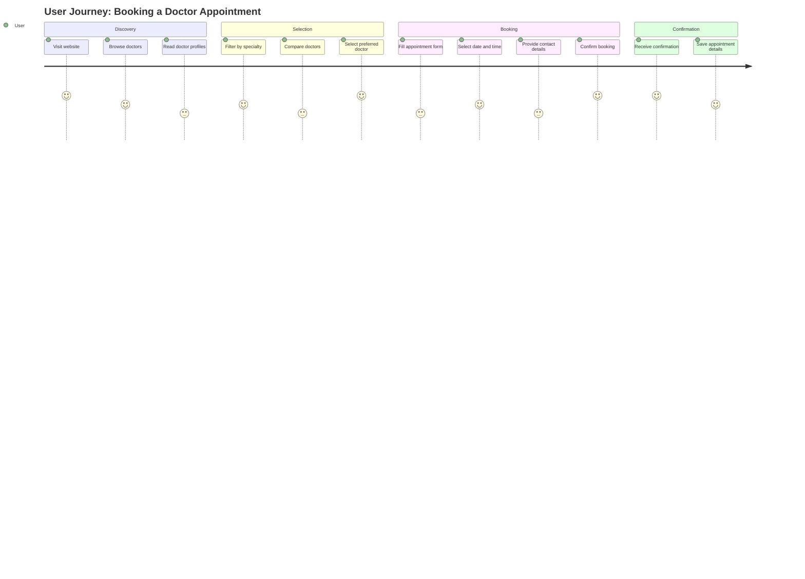
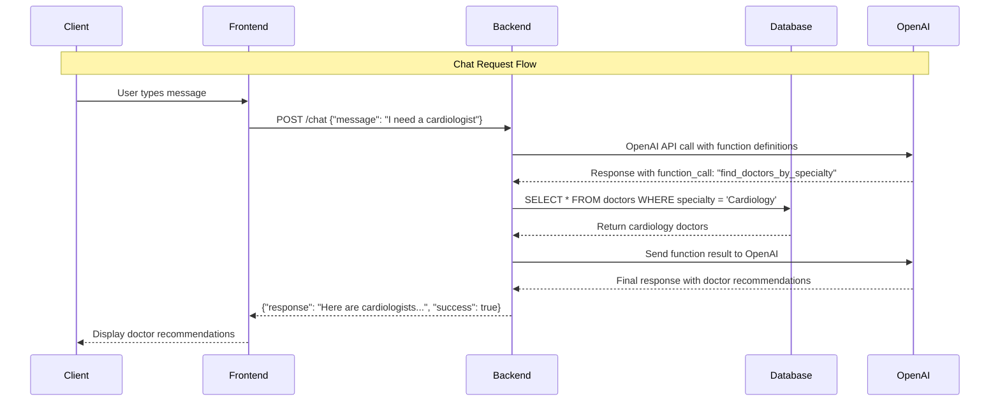
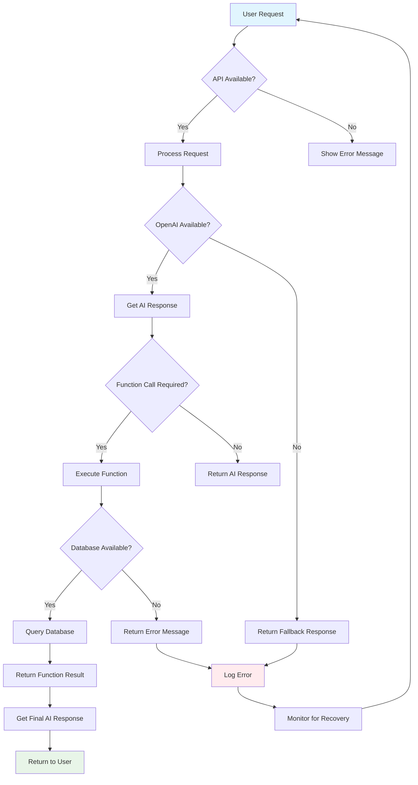

# Doctor's Assistant Chatbot - Sequence Diagrams

## 1. User Chat Flow

## 2. Doctor Search Flow

## 3. Appointment Booking Flow

## 4. System Architecture Flow

## 5. Error Handling Flow

## 6. Database Schema Relationships

## 7. Deployment Flow

## 8. User Journey Flow

## 9. API Request/Response Flow

## 10. Error Recovery Flow

